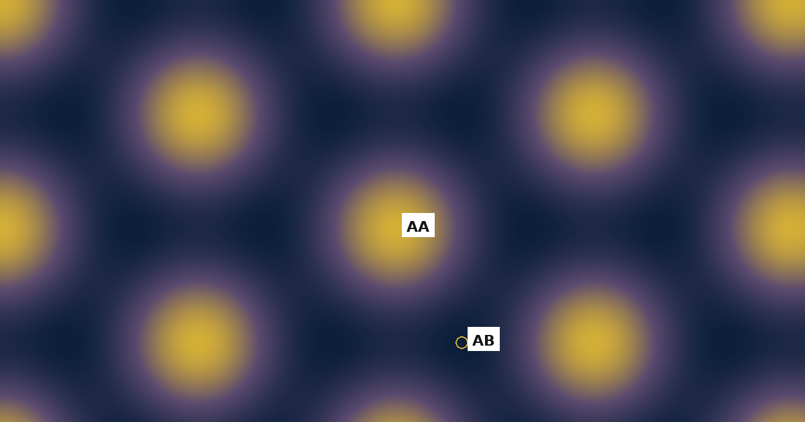

# Finite-temperature PI-QMC for moiré excitons: center-of-mass and two-body samplers, with DFT-calibrated landscapes

Code and validation scripts accompanying:

> J. R. Jarzynka, *Finite-temperature center-of-mass path-integral Monte Carlo
> of bias-driven exciton relocation and delocalization in moiré landscapes*,
> submitted to Physical Review B.

An archived, citable snapshot of this repository is available on Zenodo
(the badge below resolves to the latest version):
[](https://doi.org/10.5281/zenodo.21935778)

| Version | DOI | Notes |
|---|---|---|
| `v1.2` | [10.5281/zenodo.22730397](https://doi.org/10.5281/zenodo.22730397) | Version accompanying the submitted manuscript |
| `v1.0` | [10.5281/zenodo.21935779](https://doi.org/10.5281/zenodo.21935779) | Earlier snapshot |

This repository implements and validates a path-integral quantum Monte Carlo (PI-QMC)
engine for the center-of-mass (COM) dynamics of an exciton in a moiré-scale potential
landscape, including a staging (Brownian-bridge) sampler, JIT-compiled kernels for
numerical-grid landscapes, and a battery of validation tests against exact or
cross-checked references.

## Installation

```bash
git clone https://github.com/jrjarzynka/tmd-exciton-switching-pimc-public.git
cd tmd-exciton-switching-pimc-public
python3 -m venv .venv && source .venv/bin/activate
pip install -r requirements.txt
pip install -e .
```

`pip install -e .` installs the `tmd_pimc` package (source in `numerics/tmd_pimc/`)
in editable mode, so changes to the source are picked up without reinstalling.

## Project structure

* `numerics/tmd_pimc/` — core package: ring-polymer action (`action.py`), samplers
  (`sampler.py`, local/staging/JIT variants), potentials (`potentials.py`,
  `potential_helpers.py`), observables (`observables.py`), the primitive/virial
  energy estimators (`energy_estimators.py`), exact benchmark references
  (`analytic.py`), and the two-body electron–hole extension
  (`two_body_action.py`, `two_body_sampler*.py`; see [Two-body extension](#two-body-extension)).
* `runners/validation/` — scripts reproducing the validation sections of the manuscript
  (see table below).
* `runners/scans/`, `runners/utils/` — production scan drivers and support scripts,
  primarily for the two-body extension.
* `validation_tests/` — self-contained validation scripts (harmonic benchmark,
  autocorrelation/staging scaling, double-well relocation, periodicity audit),
  each with a short docstring describing exactly what it checks.
* `tests/` — unit tests (`pytest`) for the screened-interaction potentials and the
  radial solver used in the two-body extension.
* `moire_builder/` — commensurate moiré supercell construction via coincidence-lattice
  search (`build_commensurate_moire_v3.py`), with the validated heterostrain
  decomposition and the reference `moire_17_16.xyz` structure (θ ≈ 2.0046°, m=17/n=−16).
  Intended for future atomistic work; not required to reproduce any result
  in the center-of-mass manuscript.
* `prereg_calib.txt` — pre-registered predictions (bracketing outcome, convergence
  behavior) recorded *before* the corresponding production scans were run.
* `configs/` — JSON configuration templates for production scans. `configs/two_body/legacy/`
  contains two deliberately labeled configs (`*_COMPROMISED_*`, `*_SUPERSEDED_*`)
  kept as a documented record of a diagnosed and fixed sampling artifact, not for reuse.
* `future_work/atomistic_bridge_placeholder/` — scaffold for the planned atomistic
  (DFT/relaxation-derived) landscape extension. **Explicitly outside the scope of the
  center-of-mass manuscript**: PI-QMC's numerical-grid interface can already consume any
  properly formatted `V_grid.npz` (see `runners/validation/run_atomistic_grid_temp_field_sweep_v1_0.py`),
  but no relaxed, material-specific structure has yet been generated or validated. This
  is the identified next step of the project, not a claim made by the manuscript.

## Reproducing the validation results

Section, table, and figure numbers refer to the Physical Review B submission and
its Supplemental Material (SM).

| Manuscript location | Script(s) | Notes |
|---|---|---|
| Sec. III B, Table III, Fig. 1: autocorrelation / staging | `validation_tests/test5_IAT_scaling.py`, `test5_IAT_scaling_v2.py` | `z_local` vs. `z_staging` power-law fit |
| Sec. IV, Table IV, Fig. 2: harmonic benchmark | `validation_tests/test1_single_well.py` | PI-QMC vs. exact `harmonic_r2_analytic` (`P→∞`) and `harmonic_r2_primitive_finite_P` (exact at the *same* finite `P`) |
| Sec. IV, Table V, Fig. 3: bead-count convergence | `validation_tests/test2_P_convergence.py` | `T=5` K scan against the exact finite-`P` reference |
| Sec. V, Figs. 4–5, Table VI: bias-driven double-well relocation | `validation_tests/test3_double_well_v3.py` | Double well with occupation crossover at `Ex=0` |
| Sec. V B, Figs. 6–7: imaginary-time path spanning | `validation_tests/test3b_tunneling_snapshot.py`, `test3c_filmstrip.py` | Ring-polymer snapshots and centroid map |
| Sec. VI, Fig. 9: periodicity fix | `validation_tests/test4_periodicity_artifact.py` | Reconstructs the pre-fix bilinear-interpolation artifact from the fixed code, for direct before/after comparison |
| Sec. VI, Table VII, Fig. 8: primitive-cell cryogenic campaign | `runners/validation/run_atomistic_grid_temp_field_sweep_v1_0.py` (runner), `run_lowT_convergence_protocol_v1_1.py` (orchestrator), `analyze_atomistic_grid_pimc_v1_0.py` (per-run analysis), `compare_lowT_convergence_v1_0.py` (summary) | Also: `analyze_V_grid_landscape_v1_0.py` and `check_moire_geometry_v1_1.py` audit the input `V_grid.npz` itself (grid metadata, minima, dominant wavelength). **Note:** the registry grid is the controlled `theta=0.5°`, `disable_deformation=True` landscape described in Sec. VI, not a relaxed, material-specific structure — see `future_work/` above. |
| Sec. VII, Table VIII; SM Sec. S4: energy estimators | `runners/validation/run_energy_validation_harmonic.py`, `run_energy_validation_doublewell.py` | Uses `tmd_pimc.energy_estimators` |
| SM Sec. S1: interpolation grid-resolution convergence | `runners/validation/run_grid_resolution_convergence.py` | Seed-averaged, reports both histogram-based and histogram-free diagnostics |
| SM Sec. S2: finite-`P` validation at additional spring constants | `runners/validation/run_trotter_convergence_second_k.py` | Bracketing `k` values around the benchmark `k=0.010 eV/nm²` |

Additional diagnostics not referenced in the manuscript:
`validation_tests/test6_stability_map.py` (`A_eff^S(T,Ex)`) and `test7_chi_E.py`
(seed-to-seed centroid spread `χ_E`).

Each `runners/validation/run_*.py` script accepts `--help` for its full parameter
list and writes a CSV to `results/` (git-ignored; not tracked in this repository).

**On shipped data.** The self-contained scripts in `validation_tests/` are accompanied by their output CSVs, so those results can be inspected without
re-running anything. The `runners/validation/` scripts write
to the git-ignored `results/` directory and must be re-run to regenerate their tables;
each completes in minutes on a single core with default arguments.

**On test runtime.** A full `pytest tests/` run takes on the order of ten minutes,
dominated by Numba JIT compilation on first invocation and by the Monte Carlo
cross-validation tests. This is expected, not a hang.

## Two-body extension

`numerics/tmd_pimc/two_body_*.py`, `runners/scans/*two_body*`, and
`configs/two_body/` implement and drive a coupled electron–hole extension of this
framework. It shares the validated single-body engine but is not used for any result
of the center-of-mass manuscript. The two-body sampler underlies the interacting-pair
calculation in

> J. R. Jarzynka, *Local Stability Does Not Guarantee Quantum Accuracy: Gaussian
> Caustics in Multidimensional and Interacting Systems*, submitted to Physical Review E,

whose full reproducibility package is maintained separately at
<https://github.com/jrjarzynka/gaussian-caustics-pimc>
(Zenodo: [10.5281/zenodo.22695962](https://doi.org/10.5281/zenodo.22695962)).

## License

MIT — see `LICENSE`.
